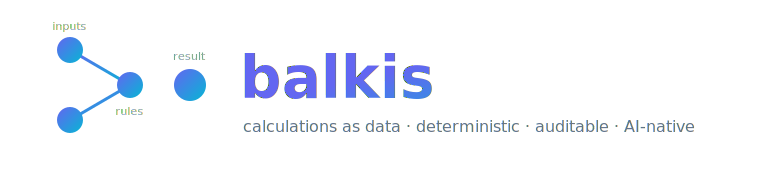
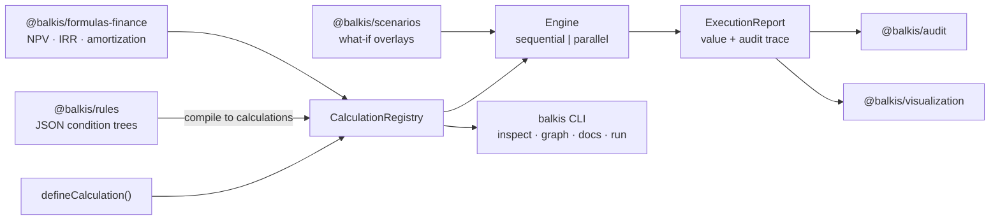

<p align="center">
  
</p>

<p align="center">
  <b>The calculation framework your AI agent can actually reason about.</b><br/>
  Define business logic as typed, self-describing data — Balkis handles execution, validation,<br/>
  dependency resolution, audit trails, what-if scenarios, and documentation.
</p>

<p align="center">
  
  
  
  
  
</p>

<p align="center">
  <a href="https://mohammadmarwanbalkis-sketch.github.io/balkis/playground.html"><b>▶ Try Balkis in your browser</b></a> — the real engine, live, nothing mocked
</p>

---

Every payroll system, pricing engine, tax calculator, and financial model rots the same way: **thousands of formulas scattered across handlers, components, and utility files** — implicit ordering, no validation at boundaries, and no way to answer *"why did this number come out this way?"*

And now there's a second reader of your codebase: **AI agents**. An agent can't safely modify a discount formula buried in a 400-line route handler. It *can* safely work with a calculation that declares its inputs, outputs, dependencies, and version as data.

## The idea in 30 seconds

```ts
import { z } from "zod";
import { defineCalculation, runCalculation } from "@balkis/core";

const grossSalary = defineCalculation({
  id: "payroll.gross-salary",
  version: "1.0.0",
  summary: "Annual gross salary: base salary plus bonus.",
  input: z.object({ baseSalary: z.number().nonnegative(), bonus: z.number().default(0) }),
  output: z.object({ gross: z.number() }),
  calculate: ({ input }) => ({ gross: input.baseSalary + input.bonus }),
});

const incomeTax = defineCalculation({
  id: "payroll.income-tax",
  version: "1.0.0",
  summary: "Flat 20% income tax on gross salary.",
  input: z.object({}),
  output: z.object({ tax: z.number() }),
  dependencies: [grossSalary],              // ← object reference: typed, refactor-safe,
  calculate: ({ deps }) => ({               //   and cycles are structurally impossible
    tax: deps["payroll.gross-salary"].gross * 0.2,
  }),
});

const result = await runCalculation(incomeTax, { baseSalary: 90_000, bonus: 10_000 });

result.value.value.tax;     // 20000 — fully typed
result.value.trace;         // complete audit trail: every step, input, output, duration
result.value.executionId;   // reproducible: same inputs + options ⇒ same run, bit for bit
```

No base classes. No decorators. No hidden execution. Calculations are frozen values; the framework derives everything else.

## Why teams pick Balkis

|  |  |
| --- | --- |
| 🧮 **Calculations as data** | Declare inputs, outputs, dependencies, versions. The engine derives execution order, validation, docs, and metadata. |
| 🔒 **Validated at every boundary** | Zod schemas guard every input *and* output. A calculation can never observe or emit an unvalidated value. |
| 🎯 **Deterministic by contract** | One frozen timestamp per run, errors as typed values, reproducible reports. `checkDeterminism` catches `Math.random()` leaks in CI. |
| 🧾 **Audit trail built in** | Every run yields the full trace — inputs, outputs, fired rules, durations — and `@balkis/audit` persists successes *and* failures. |
| ⚖️ **Rules as JSON** | `{ fact: "tier", op: "eq", value: "vip" }` condition trees with priorities and explicit strategies. Storable, diffable, generatable. |
| 🔮 **What-if scenarios** | Named input overlays, baseline comparison with per-field deltas, one-factor sensitivity analysis. |
| ⚡ **Parallel when it pays** | `mode: "parallel"` overlaps independent async branches — [measured at up to 56.8×](BENCHMARKS.md). Sync graphs stay sequential, and we tell you why. |
| 💰 **Exact decimal math** | `@balkis/decimal`: bigint fixed-point with banker's rounding. `0.1 + 0.2 = 0.3`, invoices to the exact cent, decimals travel as JSON-safe strings. |
| 🧠 **Incremental recalculation** | Pass an `ExecutionCache` and re-run: only nodes whose inputs or upstream outputs changed recompute — the rest are served from cache, marked in the trace. |
| 🤖 **AI-native metadata** | `registry.describe()` emits the whole catalog — JSON Schemas, dependency graph, rule ASTs — so agents modify logic without reading implementations. |
| 🔌 **One command to serve agents** | `balkis mcp ./module.js` — every calculation becomes an MCP tool your agent calls with validated inputs and an audit trail. `balkis serve` does the same as HTTP + OpenAPI. |
| 👥 **Shadow deployments for formulas** | Run a candidate catalog against real inputs alongside the current one; get field-level divergence before anything ships. Semantic catalog diffs flag breaking schema changes. |
| 🗣️ **Explains itself** | `explainReport(report)` renders any run as a deterministic prose narrative — which rules fired, which didn't, what each step computed. `balkis run … --explain`. |

## Built for the age of AI agents

Point any coding agent at your registry and it gets a machine-readable map of your entire business logic:

```ts
registry.describe();
// {
//   framework: "balkis",
//   calculations: [{ id, version, summary, tags, dependencies,
//                    inputSchema, outputSchema }, ...],   // JSON Schema, not prose
//   graph: { nodes: [...], edges: [{ from, to }, ...] }
// }
```

- **Discover** every calculation, its shape, and what depends on it — without executing anything
- **Modify** a formula knowing the output schema will reject regressions at the boundary
- **Explain** any historical number from the audit trace: which rules fired, which inputs flowed where
- **Generate** new calculations that are validated at definition time, not in production

Rules are pure JSON ASTs. Scenarios are pure JSON overlays. Errors carry stable machine-readable codes. This isn't an AI feature bolted on — it's what "no hidden behavior" buys you.

## How it fits together



## Quick start

```sh
pnpm add @balkis/core zod        # engine + schemas (the only runtime deps)
pnpm add @balkis/rules           # optional: declarative rule engine
pnpm add @balkis/scenarios       # optional: what-if analysis
```

Rules read like configuration because they are configuration:

```ts
const discount = ruleCalculation({
  id: "pricing.discount",
  version: "1.0.0",
  input: z.object({ customerTier: z.string() }),
  output: z.object({ discountPct: z.number() }),
  dependencies: [orderTotal],
  group: defineRuleGroup({
    id: "pricing.discount-rules",
    summary: "Selects the discount percentage.",
    rules: [
      defineRule({
        id: "vip", summary: "VIP tier gets 20%.", priority: 10,
        when: { fact: "customerTier", op: "eq", value: "vip" },
        output: { discountPct: 20 },
      }),
      defineRule({
        id: "large-order", summary: "Orders of 1000+ get 10%.", priority: 5,
        when: { fact: "pricing.order-total.total", op: "gte", value: 1000 },
        output: { discountPct: 10 },
      }),
    ],
    fallback: { discountPct: 0 },
  }),
});
```

And what-if analysis is one call:

```ts
const comparison = await runScenarios(engine, profit, baseInputs, [bestCase, worstCase]);
// diffs: [{ scenarioId: "best-case",
//           changes: [{ path: "profit", baseline: 20000, value: 30500,
//                       delta: 10500, deltaPct: 52.5 }] }]
```

**Run the full demo:** `pnpm install && pnpm build && pnpm --filter @balkis/examples demo` — payroll, rules, scenarios, and a rendered dependency graph in [examples/](examples).

## Packages

| Package | What it does | Tests |
| --- | --- | ---: |
| [`@balkis/core`](packages/core) | `defineCalculation`, registry, dependency graph, deterministic engine (sequential + parallel), audit trace, `ref()` late binding, incremental recalculation, `explainReport` | 48 |
| [`@balkis/rules`](packages/rules) | JSON condition ASTs, 14 operators + custom, priorities, first-match / all-matches, compiles to calculations | 33 |
| [`@balkis/scenarios`](packages/scenarios) | Input overlays with `extends`, baseline diffs, sensitivity analysis, seeded Monte Carlo | 25 |
| [`@balkis/decimal`](packages/decimal) | Exact bigint fixed-point decimals, five rounding modes (banker's default), Zod schema helpers | 14 |
| [`@balkis/mcp`](packages/mcp) | Model Context Protocol server — calculations as agent tools over stdio, zero deps | 7 |
| [`@balkis/versioning`](packages/versioning) | Semantic catalog diffs with breaking-change detection, shadow runs over input corpora | 8 |
| [`@balkis/formulas-finance`](packages/formulas-finance) | FV/PV, NPV, IRR, loan + amortization, depreciation, ROI — golden-tested against textbook tables | 16 |
| [`@balkis/testing`](packages/testing) | Snapshot-stable reports, golden-value cases, determinism checks | 9 |
| [`@balkis/cli`](packages/cli) | `balkis inspect / graph / docs / run / serve / mcp` — catalog tools, HTTP API with OpenAPI, MCP server | 12 |
| [`@balkis/audit`](packages/audit) | `AuditedEngine` + pluggable sinks (in-memory, JSONL); failures audited too | 6 |
| [`@balkis/visualization`](packages/visualization) | Standalone SVG/HTML dependency graphs with execution overlays | 4 |

## Performance, measured

From [BENCHMARKS.md](BENCHMARKS.md) (Node 24, Apple Silicon):

- Engine overhead: **~0.6 µs per node** — a 1,000-node graph executes and traces in ~0.6 ms
- Parallel mode on async fan-ins: **3.9× / 15.3× / 56.8×** at width 4 / 16 / 64
- Parallel mode on sync work: ~0.8× — so it's **not** the default, and the docs say so

Every performance claim in this repo has a benchmark behind it. That's [a design rule](ARCHITECTURE.md), not a slogan.

## Design decisions, written down

Fifteen recorded decisions with trade-offs in [ARCHITECTURE.md](ARCHITECTURE.md) — why dependencies are object references (D1), why errors are values (D4), why rule conditions are JSON (D7), why parallel execution preserves every determinism guarantee (D14), and more. If you disagree with one, the reasoning is there to argue with.

## Roadmap

- [x] Core engine · rules · scenarios · finance formulas · testing · CLI · audit · visualization · benchmarks
- [x] Exact-decimal arithmetic for currency-grade math (`@balkis/decimal`)
- [x] Incremental recalculation / cross-run memoization (`ExecutionCache`)
- [x] Monte Carlo scenario sampling (seeded, deterministic)
- [x] Docs site — [mohammadmarwanbalkis-sketch.github.io/balkis](https://mohammadmarwanbalkis-sketch.github.io/balkis/)
- [x] Live in-browser [playground](https://mohammadmarwanbalkis-sketch.github.io/balkis/playground.html) — the real engine, nothing mocked
- [ ] npm publish (`@balkis/*`)
- [ ] Worker-thread execution for CPU-bound graphs *(benchmarked before claimed)*

## Contributing

`pnpm install && pnpm test` gets you a green 134-test suite in seconds. See [CONTRIBUTING.md](CONTRIBUTING.md) — the short version: strict TypeScript, no hidden behavior, every phase ships with tests and docs, and performance claims require benchmarks.

## License

[MIT](LICENSE) © Mohammad Balkis

---

<p align="center">If Balkis saved your business logic from becoming spaghetti — or saved your AI agent from guessing — <b>a ⭐ helps others find it.</b></p>
