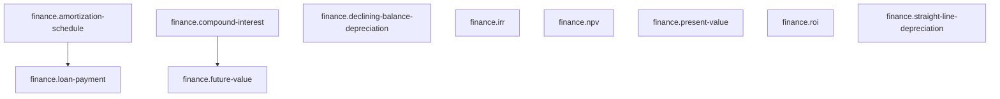

# Calculation Reference

10 calculations. Generated from `registry.describe()`.

## Dependency graph



## `finance.amortization-schedule`

Period-by-period amortization of a level-payment loan: interest, principal, and remaining balance per period, plus totals.

- **Version:** 1.0.0
- **Tags:** finance, loan
- **Dependencies:** `finance.loan-payment`

### Input

```json
{
  "$schema": "https://json-schema.org/draft/2020-12/schema",
  "type": "object",
  "properties": {
    "principal": {
      "type": "number",
      "exclusiveMinimum": 0
    }
  },
  "required": [
    "principal"
  ],
  "additionalProperties": false
}
```

### Output

```json
{
  "$schema": "https://json-schema.org/draft/2020-12/schema",
  "type": "object",
  "properties": {
    "schedule": {
      "type": "array",
      "items": {
        "type": "object",
        "properties": {
          "period": {
            "type": "integer",
            "exclusiveMinimum": 0,
            "maximum": 9007199254740991
          },
          "payment": {
            "type": "number"
          },
          "interest": {
            "type": "number"
          },
          "principal": {
            "type": "number"
          },
          "balance": {
            "type": "number"
          }
        },
        "required": [
          "period",
          "payment",
          "interest",
          "principal",
          "balance"
        ],
        "additionalProperties": false
      }
    },
    "totalPaid": {
      "type": "number"
    },
    "totalInterest": {
      "type": "number"
    }
  },
  "required": [
    "schedule",
    "totalPaid",
    "totalInterest"
  ],
  "additionalProperties": false
}
```

## `finance.compound-interest`

Interest earned under compounding: future value minus the present value.

- **Version:** 1.0.0
- **Tags:** finance, tvm
- **Dependencies:** `finance.future-value`

### Input

```json
{
  "$schema": "https://json-schema.org/draft/2020-12/schema",
  "type": "object",
  "properties": {
    "presentValue": {
      "type": "number",
      "minimum": 0
    }
  },
  "required": [
    "presentValue"
  ],
  "additionalProperties": false
}
```

### Output

```json
{
  "$schema": "https://json-schema.org/draft/2020-12/schema",
  "type": "object",
  "properties": {
    "interest": {
      "type": "number"
    }
  },
  "required": [
    "interest"
  ],
  "additionalProperties": false
}
```

## `finance.declining-balance-depreciation`

Declining-balance depreciation (factor / useful life of current book value per year, default double-declining), clamped so book value never falls below salvage.

- **Version:** 1.0.0
- **Tags:** finance, depreciation
- **Dependencies:** —

### Input

```json
{
  "$schema": "https://json-schema.org/draft/2020-12/schema",
  "type": "object",
  "properties": {
    "cost": {
      "type": "number",
      "exclusiveMinimum": 0
    },
    "salvageValue": {
      "default": 0,
      "type": "number",
      "minimum": 0
    },
    "usefulLifeYears": {
      "type": "integer",
      "exclusiveMinimum": 0,
      "maximum": 9007199254740991
    },
    "decliningFactor": {
      "default": 2,
      "type": "number",
      "exclusiveMinimum": 0
    }
  },
  "required": [
    "cost",
    "salvageValue",
    "usefulLifeYears",
    "decliningFactor"
  ],
  "additionalProperties": false
}
```

### Output

```json
{
  "$schema": "https://json-schema.org/draft/2020-12/schema",
  "type": "object",
  "properties": {
    "rate": {
      "type": "number",
      "minimum": 0
    },
    "schedule": {
      "type": "array",
      "items": {
        "type": "object",
        "properties": {
          "year": {
            "type": "integer",
            "exclusiveMinimum": 0,
            "maximum": 9007199254740991
          },
          "depreciation": {
            "type": "number",
            "minimum": 0
          },
          "bookValue": {
            "type": "number"
          }
        },
        "required": [
          "year",
          "depreciation",
          "bookValue"
        ],
        "additionalProperties": false
      }
    }
  },
  "required": [
    "rate",
    "schedule"
  ],
  "additionalProperties": false
}
```

## `finance.future-value`

Future value of a present sum under compound interest: PV × (1 + r)^n.

- **Version:** 1.0.0
- **Tags:** finance, tvm
- **Dependencies:** —

### Input

```json
{
  "$schema": "https://json-schema.org/draft/2020-12/schema",
  "type": "object",
  "properties": {
    "presentValue": {
      "type": "number",
      "minimum": 0
    },
    "ratePerPeriod": {
      "type": "number",
      "exclusiveMinimum": -1
    },
    "periods": {
      "type": "number",
      "minimum": 0
    }
  },
  "required": [
    "presentValue",
    "ratePerPeriod",
    "periods"
  ],
  "additionalProperties": false
}
```

### Output

```json
{
  "$schema": "https://json-schema.org/draft/2020-12/schema",
  "type": "object",
  "properties": {
    "futureValue": {
      "type": "number"
    }
  },
  "required": [
    "futureValue"
  ],
  "additionalProperties": false
}
```

## `finance.irr`

Internal rate of return: the periodic rate at which the cash flow series' NPV is zero.

- **Version:** 1.0.0
- **Tags:** finance, dcf
- **Dependencies:** —

### Input

```json
{
  "$schema": "https://json-schema.org/draft/2020-12/schema",
  "type": "object",
  "properties": {
    "cashflows": {
      "minItems": 2,
      "type": "array",
      "items": {
        "type": "number"
      }
    },
    "irrGuess": {
      "default": 0.1,
      "type": "number",
      "exclusiveMinimum": -1
    }
  },
  "required": [
    "cashflows",
    "irrGuess"
  ],
  "additionalProperties": false
}
```

### Output

```json
{
  "$schema": "https://json-schema.org/draft/2020-12/schema",
  "type": "object",
  "properties": {
    "irr": {
      "type": "number"
    }
  },
  "required": [
    "irr"
  ],
  "additionalProperties": false
}
```

## `finance.loan-payment`

Level annuity payment for a fully amortizing loan: P·i / (1 − (1 + i)^−n); P/n when the rate is zero.

- **Version:** 1.0.0
- **Tags:** finance, loan
- **Dependencies:** —

### Input

```json
{
  "$schema": "https://json-schema.org/draft/2020-12/schema",
  "type": "object",
  "properties": {
    "principal": {
      "type": "number",
      "exclusiveMinimum": 0
    },
    "annualRate": {
      "type": "number",
      "minimum": 0
    },
    "paymentsPerYear": {
      "default": 12,
      "type": "integer",
      "exclusiveMinimum": 0,
      "maximum": 9007199254740991
    },
    "years": {
      "type": "number",
      "exclusiveMinimum": 0
    }
  },
  "required": [
    "principal",
    "annualRate",
    "paymentsPerYear",
    "years"
  ],
  "additionalProperties": false
}
```

### Output

```json
{
  "$schema": "https://json-schema.org/draft/2020-12/schema",
  "type": "object",
  "properties": {
    "payment": {
      "type": "number",
      "exclusiveMinimum": 0
    },
    "periodicRate": {
      "type": "number",
      "minimum": 0
    },
    "totalPeriods": {
      "type": "integer",
      "exclusiveMinimum": 0,
      "maximum": 9007199254740991
    }
  },
  "required": [
    "payment",
    "periodicRate",
    "totalPeriods"
  ],
  "additionalProperties": false
}
```

## `finance.npv`

Net present value of a cash flow series at a periodic discount rate; flow at index t is discounted by (1 + r)^t.

- **Version:** 1.0.0
- **Tags:** finance, dcf
- **Dependencies:** —

### Input

```json
{
  "$schema": "https://json-schema.org/draft/2020-12/schema",
  "type": "object",
  "properties": {
    "discountRate": {
      "type": "number",
      "exclusiveMinimum": -1
    },
    "cashflows": {
      "minItems": 1,
      "type": "array",
      "items": {
        "type": "number"
      }
    }
  },
  "required": [
    "discountRate",
    "cashflows"
  ],
  "additionalProperties": false
}
```

### Output

```json
{
  "$schema": "https://json-schema.org/draft/2020-12/schema",
  "type": "object",
  "properties": {
    "npv": {
      "type": "number"
    }
  },
  "required": [
    "npv"
  ],
  "additionalProperties": false
}
```

## `finance.present-value`

Present value of a future sum: FV / (1 + r)^n.

- **Version:** 1.0.0
- **Tags:** finance, tvm
- **Dependencies:** —

### Input

```json
{
  "$schema": "https://json-schema.org/draft/2020-12/schema",
  "type": "object",
  "properties": {
    "futureAmount": {
      "type": "number"
    },
    "ratePerPeriod": {
      "type": "number",
      "exclusiveMinimum": -1
    },
    "periods": {
      "type": "number",
      "minimum": 0
    }
  },
  "required": [
    "futureAmount",
    "ratePerPeriod",
    "periods"
  ],
  "additionalProperties": false
}
```

### Output

```json
{
  "$schema": "https://json-schema.org/draft/2020-12/schema",
  "type": "object",
  "properties": {
    "presentValue": {
      "type": "number"
    }
  },
  "required": [
    "presentValue"
  ],
  "additionalProperties": false
}
```

## `finance.roi`

Return on investment: (final value − initial investment) / initial investment.

- **Version:** 1.0.0
- **Tags:** finance
- **Dependencies:** —

### Input

```json
{
  "$schema": "https://json-schema.org/draft/2020-12/schema",
  "type": "object",
  "properties": {
    "initialInvestment": {
      "type": "number",
      "exclusiveMinimum": 0
    },
    "finalValue": {
      "type": "number"
    }
  },
  "required": [
    "initialInvestment",
    "finalValue"
  ],
  "additionalProperties": false
}
```

### Output

```json
{
  "$schema": "https://json-schema.org/draft/2020-12/schema",
  "type": "object",
  "properties": {
    "roi": {
      "type": "number"
    },
    "gain": {
      "type": "number"
    }
  },
  "required": [
    "roi",
    "gain"
  ],
  "additionalProperties": false
}
```

## `finance.straight-line-depreciation`

Straight-line depreciation: (cost − salvage) / useful life, constant per year, with a year-by-year schedule.

- **Version:** 1.0.0
- **Tags:** finance, depreciation
- **Dependencies:** —

### Input

```json
{
  "$schema": "https://json-schema.org/draft/2020-12/schema",
  "type": "object",
  "properties": {
    "cost": {
      "type": "number",
      "exclusiveMinimum": 0
    },
    "salvageValue": {
      "default": 0,
      "type": "number",
      "minimum": 0
    },
    "usefulLifeYears": {
      "type": "integer",
      "exclusiveMinimum": 0,
      "maximum": 9007199254740991
    }
  },
  "required": [
    "cost",
    "salvageValue",
    "usefulLifeYears"
  ],
  "additionalProperties": false
}
```

### Output

```json
{
  "$schema": "https://json-schema.org/draft/2020-12/schema",
  "type": "object",
  "properties": {
    "annualDepreciation": {
      "type": "number",
      "minimum": 0
    },
    "schedule": {
      "type": "array",
      "items": {
        "type": "object",
        "properties": {
          "year": {
            "type": "integer",
            "exclusiveMinimum": 0,
            "maximum": 9007199254740991
          },
          "depreciation": {
            "type": "number",
            "minimum": 0
          },
          "bookValue": {
            "type": "number"
          }
        },
        "required": [
          "year",
          "depreciation",
          "bookValue"
        ],
        "additionalProperties": false
      }
    }
  },
  "required": [
    "annualDepreciation",
    "schedule"
  ],
  "additionalProperties": false
}
```
